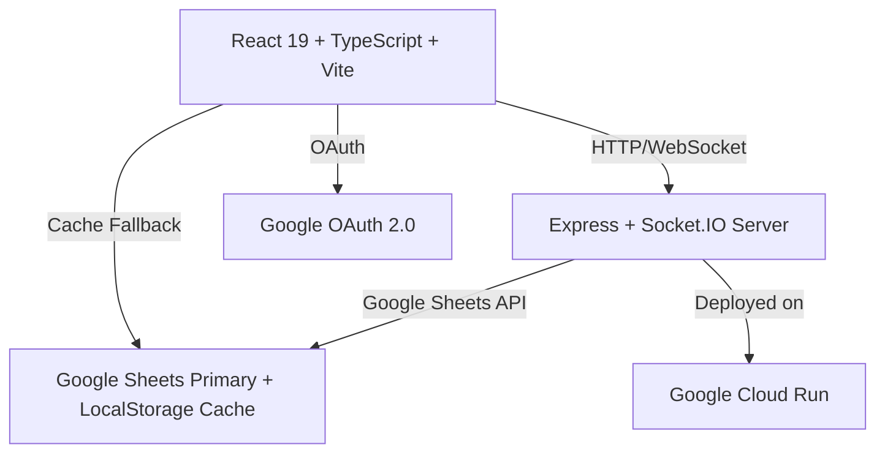
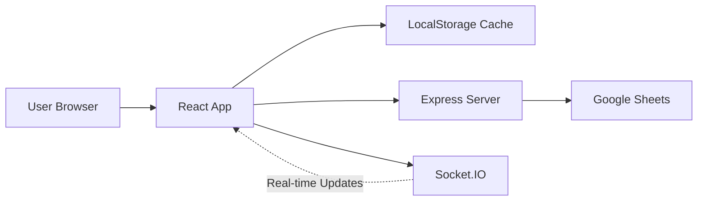

# Portfolio Management App - Master Context

> **Purpose**: This document serves as the master context for all collaboration on the Portfolio Work Plan Manager application. It defines how we answer questions, design solutions, deploy changes, and maintain consistency throughout our work together.

**Use this document by referencing `@MASTER_CONTEXT` in Cursor to ensure all work follows established patterns and protocols.**

---

## Table of Contents

1. **Application Architecture Overview**
2. **Design & Development Patterns**
3. **Deployment Procedures**
4. **Communication Standards**
5. **Troubleshooting & Debugging**
6. **Critical Rules & Guardrails**

---

## 1. Application Architecture Overview

### Tech Stack



**Key Technologies:**

- **Frontend**: React 19, TypeScript, Vite, Tailwind CSS
- **Backend**: Node.js, Express, Socket.IO, Google Sheets API
- **Data Layer**: Google Sheets (primary), LocalStorage (cache/fallback)
- **Authentication**: Google OAuth (@react-oauth/google)
- **Real-time**: Socket.IO for collaboration
- **Deployment**: Google Cloud Run (containerized)

### System Architecture



**Data Flow Principles:**

1. **Google Sheets is PRIMARY** - Source of truth for all persistent data
2. **LocalStorage is CACHE** - Offline fallback and optimistic updates
3. **Real-time Sync** - Socket.IO broadcasts changes to all connected users
4. **Optimistic UI** - Update UI immediately, sync in background

### Key Files & Responsibilities

| Path | Purpose |
|------|---------|
| [`src/App.tsx`](src/App.tsx) | Main application orchestrator, state management |
| [`server/index.ts`](server/index.ts) | Express server, API routes, Socket.IO |
| [`src/services/googleSheetsSync.ts`](src/services/googleSheetsSync.ts) | Primary sync service with queue management |
| [`src/services/realtimeService.ts`](src/services/realtimeService.ts) | Socket.IO client |
| [`src/constants/index.ts`](src/constants/index.ts) | Static data, initial configs, users |
| [`src/types/index.ts`](src/types/index.ts) | All TypeScript type definitions |

---

## 2. Design & Development Patterns

### A. State Management Pattern

**Current User State:**

```typescript
// Always derive from auth context first
const { user: authUser, isAuthenticated } = useAuth();
const currentUser = authUser || users.find(u => u.email === 'fallback@example.com') || users[0];
```

**Initiative State Management:**

```typescript
// ALWAYS use functional updates to prevent race conditions
setInitiatives(prev => {
  // Deduplicate first (safety check)
  const deduplicatedPrev = deduplicateInitiatives(prev);
  
  // Apply changes
  const updated = deduplicatedPrev.map(i => 
    i.id === targetId ? { ...i, ...changes } : i
  );
  
  return updated;
});
```

**Critical Pattern: No Duplicate IDs**

- ALWAYS deduplicate before rendering or saving
- Use `deduplicateInitiatives()` helper (keeps first occurrence)
- Check for duplicates in queue before syncing

### B. Data Persistence Pattern

**Three-Layer Sync:**

```typescript
// 1. Update React state (immediate UI update)
setInitiatives(prev => [...updated]);

// 2. Update LocalStorage cache (optimistic persistence)
localStorage.setItem('portfolio-initiatives-cache', JSON.stringify(updated));

// 3. Queue sync to Google Sheets (background, debounced)
sheetsSync.queueInitiativeSync(initiative);

// 4. Broadcast to other users (real-time collaboration)
realtimeService.broadcastUpdate(initiative);
```

**When to Force Immediate Sync:**

- Creating new initiatives (`sheetsSync.forceSyncNow()`)
- Critical status changes (At Risk, Deleted)
- User-triggered save operations

### C. Permission System Design

**Role-Based Access Control:**

```typescript
// Check permissions using config + role
const canCreate = canCreateTasks(config, currentUser.role);
const canViewAdmin = canViewTab(config, currentUser.role, 'accessAdmin');

// Permission types:
// - 'yes': Full access
// - 'own': Only own items
// - 'view': Read-only
// - 'no': No access
```

**When Adding New Features:**

1. Check if permission already exists in `PermissionKey` type
2. If new, add to `RolePermissions` interface in [`src/types/index.ts`](src/types/index.ts)
3. Add default permissions in `INITIAL_CONFIG.rolePermissions` in [`src/constants/index.ts`](src/constants/index.ts)
4. Use migration logic in `App.tsx` to update existing configs

### D. Component Design Patterns

**Modal Pattern:**

```typescript
// State in parent
const [isModalOpen, setIsModalOpen] = useState(false);
const [editingItem, setEditingItem] = useState<Initiative | null>(null);

// Open for edit
const handleEdit = (initiative: Initiative) => {
  setEditingItem(initiative);
  setIsModalOpen(true);
};

// Open for create
const handleCreate = () => {
  setEditingItem(null);
  setIsModalOpen(true);
};

// Modal determines mode by checking editingItem
```

**Inline Update Pattern:**

```typescript
// For simple field updates without modal
const handleInlineUpdate = (id: string, field: keyof Initiative, value: any) => {
  setInitiatives(prev => prev.map(i => 
    i.id === id ? { ...i, [field]: value } : i
  ));
  
  // Always sync after inline updates
  const updated = initiatives.find(i => i.id === id);
  if (updated) sheetsSync.queueInitiativeSync(updated);
};
```

### E. Error Handling & Logging

**Use Structured Logging:**

```typescript
import { logger } from '../utils/logger';

// Log with context and metadata
logger.error('Failed to sync initiative', {
  context: 'ComponentName.functionName',
  error: error instanceof Error ? error : new Error(String(error)),
  metadata: { initiativeId: id, attemptCount: retries }
});
```

**Toast Notifications:**

```typescript
const { showSuccess, showError, showInfo } = useToast();

try {
  // ... operation
  showSuccess('Operation completed successfully');
} catch (error) {
  logger.error('Operation failed', { context: 'Component.operation', error });
  showError('Failed to complete operation. Please try again.');
}
```

### F. Workflow System Design

**When Adding Workflow Triggers:**

1. Add trigger type to `WorkflowTrigger` enum in types
2. Implement trigger logic in `workflowEngine.ts`
3. Add trigger configuration UI in `WorkflowBuilder.tsx`
4. Document trigger behavior in workflow execution logs

**Workflow Execution Pattern:**

```typescript
// Always use ref for latest data in async operations
const initiativesRef = useRef<Initiative[]>([]);

// Execute workflow with copy
const initiativesCopy = initiativesRef.current.map(i => ({ ...i }));
await workflowEngine.executeWorkflow(workflow, initiativesCopy, recordChange);

// Merge changes back using functional update
setInitiatives(prev => {
  const modifiedMap = new Map(initiativesCopy.map(i => [i.id, i]));
  return prev.map(i => modifiedMap.get(i.id) || i);
});
```

---

## 3. Deployment Procedures

### A. Deployment Architecture

**Cloud Run Setup:**

- **Project ID**: `research-modeling-vertex-ai`
- **Service Name**: `portfolio-manager`
- **Region**: `us-central1`
- **Port**: `8080` (Cloud Run standard)
- **Session Affinity**: **ENABLED** (required for Socket.IO)

### B. Deployment Methods

**Method 1: Quick Deploy Script (Recommended)**

```bash
# One-command deployment
./QUICK_DEPLOY.sh
```

This script handles:

- Authentication
- API enablement
- Service account creation
- Secret management
- Docker build & push
- Cloud Run deployment

**Method 2: Manual Package Upload**

```bash
# 1. Package source code
./package-for-cloudrun.sh

# 2. Upload via Cloud Console
# Navigate to: https://console.cloud.google.com/run
# Click "CREATE SERVICE" or "EDIT & DEPLOY NEW REVISION"
# Upload: portfolio-manager-cloudrun-source.zip
```

**Method 3: CI/CD with Cloud Build**

```bash
# Trigger build from repository
gcloud builds submit --config cloudbuild.yaml
```

### C. Environment Configuration

**Required Environment Variables:**

```bash
NODE_ENV=production
PORT=8080
SERVE_STATIC=true
GCS_BUCKET_NAME=portfolio-manager-data
GCS_PROJECT_ID=research-modeling-vertex-ai
```

**Required Secrets (Secret Manager):**

```bash
JWT_SECRET=portfolio-jwt-secret:latest
CORS_ALLOWED_ORIGINS=portfolio-cors-origins:latest
GOOGLE_SHEETS_CREDENTIALS=portfolio-sheets-credentials:latest
```

**Setting Secrets:**

```bash
# JWT Secret
openssl rand -base64 32 | gcloud secrets create portfolio-jwt-secret --data-file=-

# CORS Origins
echo -n "https://your-domain.com,*" | gcloud secrets create portfolio-cors-origins --data-file=-
```

### D. Deployment Checklist

Before deploying:

- [ ] Run `npm run typecheck` - Verify no TypeScript errors
- [ ] Run `npm run lint` - Check for linting issues
- [ ] Test locally with `npm run dev:all` - Frontend + Backend
- [ ] Verify `.gcloudignore` excludes `node_modules`, `.env`, `*.zip`
- [ ] Check `cloudbuild.yaml` has correct Node version (18+)
- [ ] Ensure secrets exist in Secret Manager
- [ ] Verify service account has permissions

After deploying:

- [ ] Check logs: `gcloud run services logs read portfolio-manager --region us-central1`
- [ ] Test health endpoint: `curl https://[SERVICE_URL]/api/sheets/health`
- [ ] Verify Google Sheets sync works
- [ ] Test Socket.IO connection (check browser console)
- [ ] Test authentication flow

### E. Version Tagging Rationale

**Semantic Versioning: MAJOR.MINOR.PATCH**

We follow semantic versioning to track changes and communicate the nature of updates clearly.

**Version Format: `X.Y.Z`**

- **X (MAJOR)**: Breaking changes or major architectural updates
- **Y (MINOR)**: New features, non-breaking changes
- **Z (PATCH)**: Bug fixes, security patches, minor tweaks

**When to Bump Each Version:**

**PATCH (1.0.0 → 1.0.1)** - Use when:

- Fixing bugs that don't change functionality
- Security patches
- Performance improvements
- Documentation updates
- UI polish (colors, spacing, typos)
- Dependency updates (non-breaking)

**MINOR (1.0.0 → 1.1.0)** - Use when:

- Adding new features (new views, components, workflows)
- Adding new API endpoints
- Enhancing existing features without breaking them
- Adding new permissions or roles
- Adding new integrations (Slack, Google Sheets features)

**MAJOR (1.0.0 → 2.0.0)** - Use when:

- Breaking API changes
- Database/data structure changes requiring migration
- Removing features or endpoints
- Major architectural changes (e.g., switching from localStorage to Google Sheets)
- Changes requiring user re-authentication or data reset
- Deployment architecture changes (e.g., moving from one cloud provider to another)

**Versioning Workflow:**

**Before Deployment:**

```bash
# 1. Determine version type based on changes
# 2. Update version
npm run version:patch   # For bug fixes
npm run version:minor   # For new features
npm run version:major   # For breaking changes

# This will:
# - Update package.json
# - Create a git commit with version
# - Create a git tag (e.g., v1.2.3)

# 3. Push with tags
git push origin main --tags
```

**After Deployment:**

```bash
# Verify deployed version
npm run version:show

# Or check in the app (add version display in footer/admin panel)
```

**Version Display:**

Add version info to the UI (recommended in AdminPanel or footer):

```typescript
const version = import.meta.env.VITE_APP_VERSION || require('../package.json').version;

// Display in UI
<div className="text-xs text-slate-400">
  Version {version}
</div>
```

**CHANGELOG.md Convention:**

Update `CHANGELOG.md` with each version:

```markdown
## [1.2.0] - 2025-12-28

### Added
- Date range filter for initiatives
- Export to Excel functionality

### Fixed
- Duplicate initiatives issue in real-time sync

### Changed
- Improved performance for large datasets
```

**When NOT to Version:**

- During active development before deployment
- Local testing/experimentation
- Hot fixes that will be immediately superseded
- Documentation-only changes (unless significant)

**Pre-Release Versions (Optional):**

For beta testing before full release:

```bash
# Beta release
npm version 1.2.0-beta.1
npm version 1.2.0-beta.2

# Release candidate
npm version 1.2.0-rc.1

# Final release
npm version 1.2.0
```

**Quick Decision Tree:**

```
Did you break existing functionality? → MAJOR
↓ No
Did you add new features? → MINOR
↓ No
Did you fix bugs or make small improvements? → PATCH
```

### F. Troubleshooting Deployment Issues

**Build Fails:**

```bash
# Check Cloud Build logs
gcloud builds list --limit 5
gcloud builds log [BUILD_ID]

# Common fixes:
# - Ensure package.json has all dependencies
# - Check Dockerfile Node version matches package.json engines
# - Verify no syntax errors in TypeScript
```

**Service Won't Start:**

```bash
# Check service logs
gcloud run services logs read portfolio-manager --region us-central1 --limit 100

# Common issues:
# - Port mismatch (must be 8080 for Cloud Run)
# - Missing environment variables
# - Secrets not accessible (check IAM permissions)
# - Google Sheets API not enabled
```

**Socket.IO Connection Fails:**

- Verify **Session Affinity is ENABLED** in Cloud Run service settings
- Check CORS_ALLOWED_ORIGINS includes your domain
- Ensure WebSocket transport is allowed (not blocked by firewall)

---

## 4. Communication Standards

### A. How to Answer Questions

**Pattern: Context → Analysis → Solution → Verification**

1. **Acknowledge and Clarify**
   - Confirm understanding of the question
   - Ask clarifying questions if needed
   - Reference specific files/lines when relevant

2. **Provide Context**
   - Explain where in the codebase the solution applies
   - Mention related systems/components
   - Link to relevant files using full paths

3. **Present Solution**
   - Show code examples with proper syntax
   - Explain the "why" behind the approach
   - Mention alternatives and trade-offs

4. **Verification Steps**
   - How to test the change
   - What to look for in logs/console
   - Potential edge cases to consider

**Example Response Format:**

```markdown
## Understanding the Issue

You're asking about [topic]. This relates to [component/system] in the codebase, 
specifically in [`path/to/file.ts`](path/to/file.ts).

## Current Implementation

Currently, the code works by:
[explanation with code reference]

## Recommended Solution

Here's how to implement this:

[code example with comments]

This approach is preferred because:
- Reason 1
- Reason 2

## Testing

To verify this works:
1. Step 1
2. Step 2
3. Expected result

## Alternative Approaches

Alternative 1: [brief description]
Trade-off: [pros/cons]
```

### B. When Suggesting Plans or Changes

**CRITICAL RULE: Always Start with a Plain-English Summary**

Every plan, proposal, or suggested change MUST begin with a simple, non-technical paragraph that:

- Explains **what** we're going to do (in everyday language)
- Explains **why** it matters (the business value or user benefit)
- Avoids technical jargon, code terms, or implementation details

**Example:**

✅ **Good Opening:**

> We're going to add a new way for users to filter their tasks by date range. Right now, users can only see all tasks at once, which makes it hard to focus on what's due soon. This change will let them pick a start and end date to see only the tasks they care about, making the app easier to use when managing lots of work items.

❌ **Bad Opening:**

> We need to implement a date range filter component using React state hooks and integrate it with the existing FilterBar component through props drilling, updating the useMemo dependency array to trigger re-filtering when date values change.

**After the plain-English summary,** then provide the technical details, implementation steps, and code examples.

### C. Code References

**Always Use Full Paths:**

- Good: [`src/components/views/AdminPanel.tsx`](src/components/views/AdminPanel.tsx)
- Bad: `AdminPanel.tsx`

**When Showing Code:**

- Include line numbers for existing code
- Add comments explaining non-obvious logic
- Show before/after for changes

### D. Documentation Style

**When Creating/Updating Docs:**

- Use clear section headers
- Include code examples
- Add command-line examples with expected output
- Link to related documentation
- Keep it up-to-date (update with code changes)

**Markdown Conventions:**

- Use `code blocks` for commands, file names, variables
- Use **bold** for emphasis
- Use *italics* for notes/warnings
- Use > blockquotes for important callouts

---

## 5. Troubleshooting & Debugging

### A. Common Issues & Solutions

**Issue: Duplicate Initiatives Appearing**

Diagnosis:

```typescript
// Check for duplicates in state
const duplicates = initiatives.filter((item, index, arr) => 
  arr.findIndex(i => i.id === item.id) !== index
);
console.log('Duplicates found:', duplicates);
```

Solution:

- Run deduplication: `const deduped = deduplicateInitiatives(initiatives);`
- Check queue persistence: Look for duplicate queue saves
- Verify real-time events aren't creating duplicates
- Clear corrupted cache: `localStorage.removeItem('portfolio-initiatives-cache')`

**Issue: Google Sheets Sync Not Working**

Diagnosis:

```bash
# Check sync status
console.log(sheetsSync.getStatus());

# Check backend logs
gcloud run services logs read portfolio-manager --region us-central1 --limit 50
```

Solution:

- Verify backend is running (`npm run server` locally)
- Check authentication: `authService.isAuthenticated()`
- Verify Google Sheets credentials in secrets
- Check API quota limits (Sheets API has rate limits)
- Force sync: `sheetsSync.forceSyncNow()`

**Issue: Socket.IO Not Connecting**

Diagnosis:

```typescript
// Check connection status
console.log('Socket connected:', realtimeService.isConnected());

// Listen for connection errors
socket.on('connect_error', (err) => console.error('Socket error:', err));
```

Solution:

- Verify backend is running and accessible
- Check CORS configuration (backend must allow frontend origin)
- Ensure Session Affinity is enabled on Cloud Run
- Test WebSocket connectivity (browser network tab)

**Issue: Permission Denied Errors**

Diagnosis:

```typescript
// Check current user permissions
console.log('Current role:', currentUser.role);
console.log('Permissions:', config.rolePermissions[currentUser.role]);
```

Solution:

- Verify user role is correctly set
- Check permission configuration in AdminPanel
- Clear localStorage if config is corrupted: `localStorage.removeItem('portfolio-config')`
- Verify permission migration ran (check console for migration logs)

### B. Debugging Workflow

**1. Client-Side Issues:**

```javascript
// Enable verbose logging
localStorage.setItem('debug', 'portfolio:*');

// Check state
console.log('Current initiatives:', initiatives);
console.log('Sync status:', sheetsSync.getStatus());
console.log('Auth status:', authService.isAuthenticated());
```

**2. Server-Side Issues:**

```bash
# Local development
npm run server  # Check console output

# Production
gcloud run services logs read portfolio-manager \
  --region us-central1 \
  --limit 100 \
  --format "table(timestamp,severity,textPayload)"
```

**3. Network Issues:**

- Check browser DevTools Network tab
- Look for failed API requests
- Verify CORS headers in response
- Check WebSocket connection status

### C. Performance Debugging

**Large Dataset Issues:**

```typescript
// Profile render performance
const startTime = performance.now();
// ... render operation
console.log('Render took:', performance.now() - startTime, 'ms');

// Check data size
console.log('Initiatives count:', initiatives.length);
console.log('LocalStorage size:', JSON.stringify(initiatives).length, 'bytes');
```

**Solutions:**

- Implement pagination for large tables
- Use React.memo() for expensive components
- Debounce filter operations
- Virtualize long lists (react-window)

---

## 6. Critical Rules & Guardrails

### A. Never Do This

❌ **Modify state directly**

```typescript
// BAD
initiatives[0].status = Status.Done;

// GOOD
setInitiatives(prev => prev.map(i => 
  i.id === target.id ? { ...i, status: Status.Done } : i
));
```

❌ **Use stale closures in async operations**

```typescript
// BAD
setTimeout(() => {
  setInitiatives([...initiatives, newItem]); // initiatives is stale
}, 1000);

// GOOD
setTimeout(() => {
  setInitiatives(prev => [...prev, newItem]); // prev is always current
}, 1000);
```

❌ **Skip deduplication before rendering**

```typescript
// BAD
initiatives.map(i => <InitiativeRow key={i.id} initiative={i} />)

// GOOD
const dedupedInitiatives = deduplicateInitiatives(initiatives);
dedupedInitiatives.map(i => <InitiativeRow key={i.id} initiative={i} />)
```

❌ **Hardcode credentials or secrets**

```typescript
// BAD
const API_KEY = 'sk-1234567890';

// GOOD
const API_KEY = import.meta.env.VITE_API_KEY;
```

❌ **Commit sensitive files**

- Never commit `.env` files
- Never commit service account keys
- Never commit `node_modules/`
- Never commit build artifacts (`.zip` files)

### B. Always Do This

✅ **Use functional state updates**

```typescript
setInitiatives(prev => {
  // Always work with prev, not captured closure
  return prev.map(i => /* ... */);
});
```

✅ **Check authentication before API calls**

```typescript
if (!authService.isAuthenticated()) {
  showError('Please log in first');
  return;
}
```

✅ **Handle errors gracefully**

```typescript
try {
  // operation
} catch (error) {
  logger.error('Operation failed', { context: 'Component.function', error });
  showError('User-friendly message');
}
```

✅ **Sync after state changes**

```typescript
// Update state
setInitiatives(updated);

// Update cache
localStorage.setItem('cache-key', JSON.stringify(updated));

// Queue sync
sheetsSync.queueInitiativeSync(initiative);

// Broadcast to others
realtimeService.broadcastUpdate(initiative);
```

✅ **Test changes locally before deploying**

```bash
# Start both frontend and backend
npm run dev:all

# Test in browser
# Verify no console errors
# Test key workflows
```

### C. Code Review Checklist

Before considering a feature complete:

- [ ] TypeScript types are correct (no `any` unless necessary)
- [ ] Error handling is implemented
- [ ] Logging is added for debugging
- [ ] State updates use functional pattern
- [ ] Permissions are checked (if applicable)
- [ ] Data is synced to all three layers (state, cache, Sheets)
- [ ] Real-time events are broadcasted (if multi-user feature)
- [ ] Edge cases are handled (empty arrays, null values, etc.)
- [ ] No duplicate IDs in data structures
- [ ] Toast notifications provide user feedback
- [ ] Loading states are shown during async operations

---

## 7. Quick Reference

### File Structure

```
portfolio-management/
├── src/
│   ├── App.tsx                    # Main app orchestrator
│   ├── components/
│   │   ├── auth/                  # Login components
│   │   ├── modals/                # Modal dialogs
│   │   ├── shared/                # Reusable UI components
│   │   └── views/                 # Main view components
│   ├── constants/                 # Static data & config
│   ├── contexts/                  # React contexts (Auth, Toast)
│   ├── hooks/                     # Custom React hooks
│   ├── services/                  # API & sync services
│   ├── types/                     # TypeScript definitions
│   └── utils/                     # Utility functions
├── server/
│   ├── index.ts                   # Express server & Socket.IO
│   ├── gcsStorage.ts              # Google Cloud Storage
│   └── validation.ts              # Input validation
├── docs/                          # Documentation
├── scripts/                       # Deployment scripts
└── [config files]                 # Build & deploy configs
```

### Key Commands

```bash
# Development
npm run dev                        # Frontend only
npm run server                     # Backend only
npm run dev:all                    # Both frontend + backend

# Build
npm run build                      # Build both frontend & backend
npm run build:frontend             # Build React app
npm run build:server               # Compile TypeScript server

# Quality
npm run typecheck                  # TypeScript type checking
npm run lint                       # ESLint
npm run format                     # Prettier formatting

# Deployment
./QUICK_DEPLOY.sh                  # Full deployment to Cloud Run
./package-for-cloudrun.sh          # Create source package

# Testing
npm run test                       # Unit tests
npm run test:e2e                   # End-to-end tests
```

### Important URLs

- **Cloud Console**: https://console.cloud.google.com/run
- **Secret Manager**: https://console.cloud.google.com/security/secret-manager
- **Cloud Build**: https://console.cloud.google.com/cloud-build
- **Sheets API Console**: https://console.cloud.google.com/apis/library/sheets.googleapis.com

---

## 8. Revision History

| Date | Change | Reason |
|------|--------|--------|
| 2025-12-28 | Initial creation | Establish work protocol |
| 2025-12-28 | Added plain-English summary requirement | Ensure non-technical stakeholders can understand proposals |
| 2025-12-28 | Added version tagging rationale | Define semantic versioning strategy and workflow |

---

**This master context is a living document.** Update it as patterns evolve, new features are added, or deployment procedures change.

